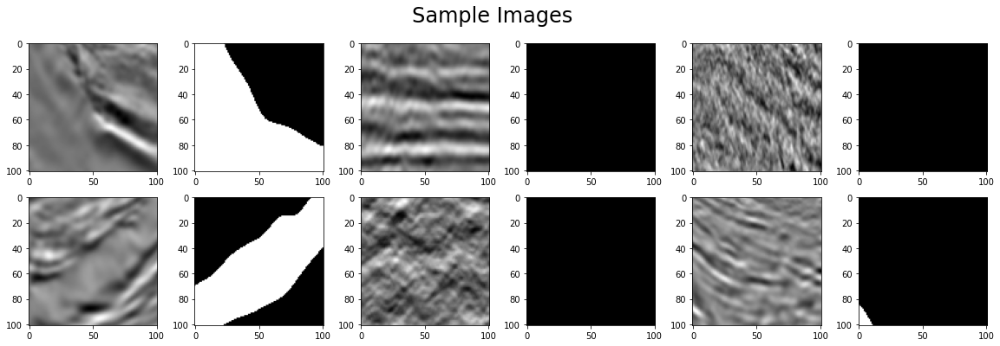
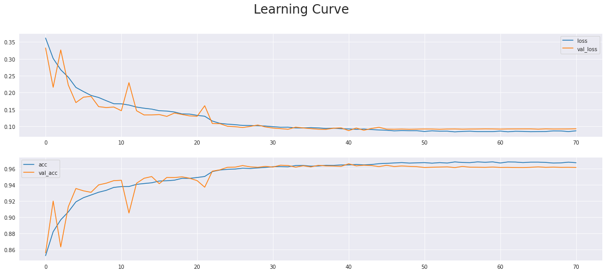

## 土壤盐分判别————基于Unet-ResNet Encoder-Decoder的图像分割网络  
### Participation of Kaggle: TGS Salt Identification Challenge  
### Download Dataset   
```bash
wget --trust-server-names https://cloud.tsinghua.edu.cn/f/51674c597850411cb39c/?dl=1
unzip tgs-salt-identification-challenge.zip
```
## install libraries：  
```bash
pip install tqdm skimage -i https://pypi.tuna.tsinghua.edu.cn/simple  

```
### Dataset  
The data is a set of images chosen at various locations chosen at random in the subsurface. The images are 101 x 101 pixels and each pixel is classified as either salt or sediment. In addition to the seismic images, the depth of the imaged location is provided for each image. The goal of the competition is to segment regions that contain salt.   

To retrain the model, you need to unzip all the zip files including three subdataset: training, competition_data and test data.  

### Train
```bash
python train.py
```
After 70epochs of training, you may obtain the following learning curve:
  
